# 关于Flex（弹性）布局

[TOC]

### 零、注意

1.使用flex非常方便。但是要注意区分容器（container）的属性和容器中项目（item）的属性。

2.flex的核心是对于空间的分配。


### 一、概念

flex—“弹性布局”在2009年推出，可以简便、完整、响应式地实现各种页面布局，目前，它已经得到所有浏览器的支持。

将父容器的display设置成flex，子元素自动成为容器成员。

```css
.box{
  display: flex;
}
```

设为Flex布局以后，子元素的`float`、`clear`和`vertical-align`属性将失效 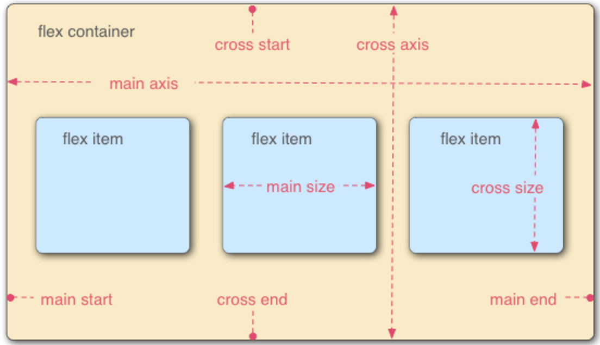

容器存在两根轴：水平的主轴（main axis）和垂直的交叉轴（cross axis）。主轴的开始位置（与边框的交叉点）叫做`main start`，结束位置叫做`main end`；交叉轴的开始位置叫做`cross start`，结束位置叫做`cross end`。

项目默认沿主轴排列。单个项目占据的主轴空间叫做`main size`，占据的交叉轴空间叫做`cross size`。

### 二、容器的属性

- flex-direction
- flex-wrap
- flex-flow
- justify-content
- align-items
- align-content

#### 1.flex-direction

排布方向

- `row`（默认值）：主轴为水平方向，起点在左端。
- `row-reverse`：主轴为水平方向，起点在右端。
- `column`：主轴为垂直方向，起点在上沿。
- `column-reverse`：主轴为垂直方向，起点在下沿。

示例

```html
<!DOCTYPE html>
<html>
<head>
<meta charset="utf-8">
<style>
#main {
    display: flex;
    flex-direction:xxxxxx;
}
  
#main div {
	width: 40px;
	height: 40px;
}
</style>
</head>
<body>

<div id="main">
	<div style="background-color:coral;">A</div>
	<div style="background-color:lightblue;">B</div>
	<div style="background-color:khaki;">C</div>
	<div style="background-color:pink;">D</div>
	<div style="background-color:lightgrey;">E</div>
	<div style="background-color:lightgreen;">F</div>
</div>

</body>
</html>

```

xxxxx设置为以上四个值分别得到 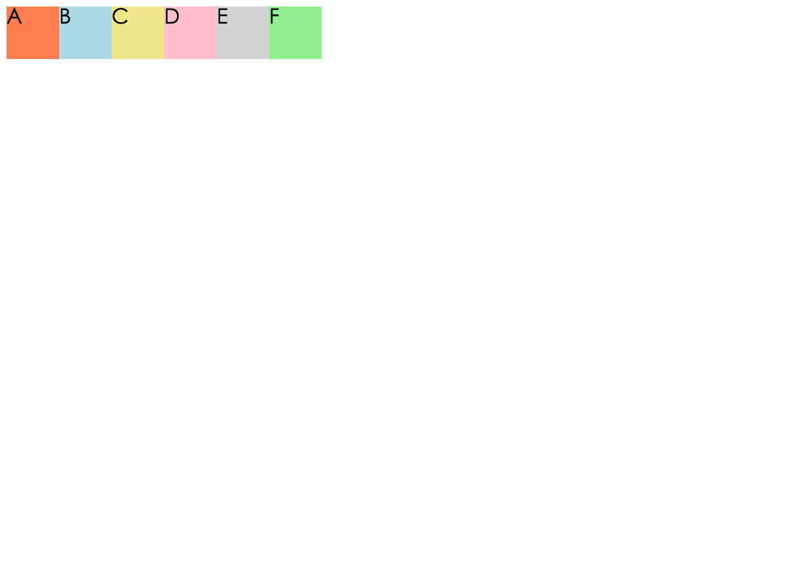 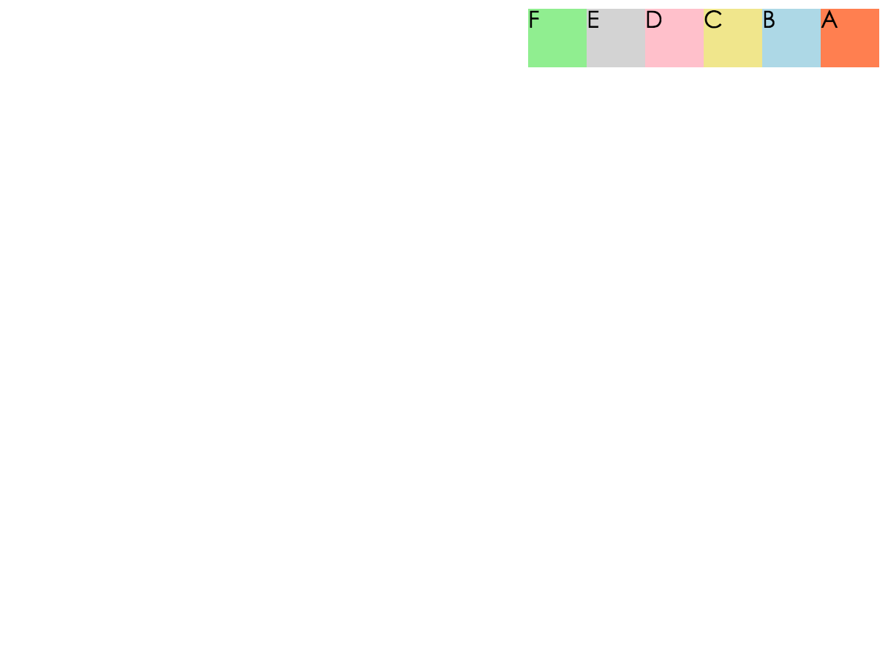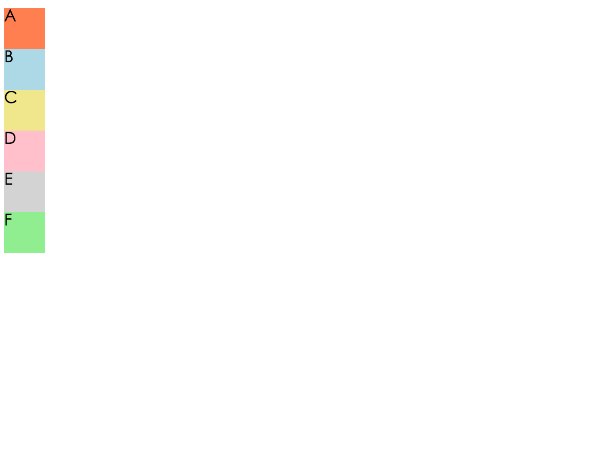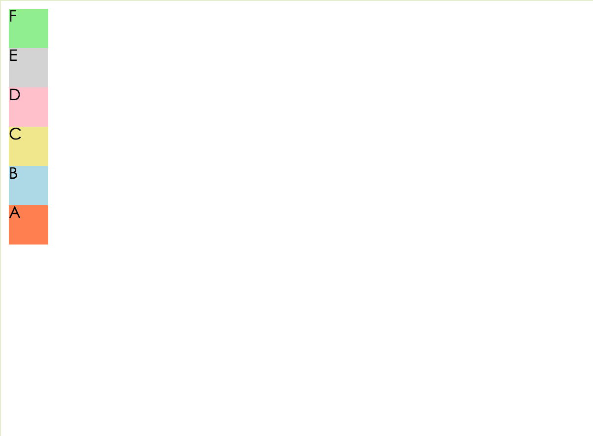

#### 2.flex-wrap

- wrap
- nowrap(默认)
- wrap-reverse

示例

```html
<!DOCTYPE html>
<html>
<head>
<meta charset="utf-8">
<title></title>
<style>
#main {
    display: flex;
    flex-direction:row;
	flex-wrap:xxxxxxxxxxxxxxxxxxxx;
}
  
#main div {
	width: 40px;
	height: 40px;
}
</style>
</head>
<body>

<div id="main">
	<div style="background-color:coral;">A</div>
	<div style="background-color:lightblue;">B</div>
	<div style="background-color:khaki;">C</div>
	<div style="background-color:pink;">D</div>
	<div style="background-color:lightgrey;">E</div>
	<div style="background-color:lightgreen;">F</div>
	<div style="background-color:coral;">A</div>
	<div style="background-color:lightblue;">B</div>
	<div style="background-color:khaki;">C</div>
	<div style="background-color:pink;">D</div>
	<div style="background-color:lightgrey;">E</div>
	<div style="background-color:lightgreen;">F</div>
	<div style="background-color:coral;">A</div>
	<div style="background-color:lightblue;">B</div>
	<div style="background-color:khaki;">C</div>
	<div style="background-color:pink;">D</div>
	<div style="background-color:lightgrey;">E</div>
	<div style="background-color:lightgreen;">F</div>
	<div style="background-color:coral;">A</div>
	<div style="background-color:lightblue;">B</div>
	<div style="background-color:khaki;">C</div>
	<div style="background-color:pink;">D</div>
	<div style="background-color:lightgrey;">E</div>
	<div style="background-color:lightgreen;">F</div>
</div>

</body>
</html>
```

以上属性一次替代 xxxxxxx 分别得到： 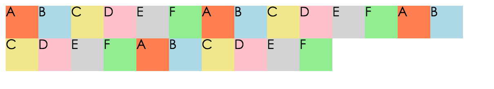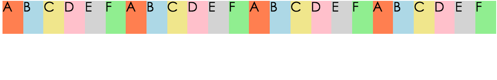 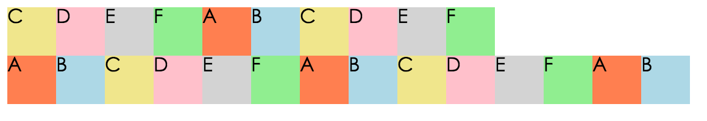

#### 3.flex-flow

`flex-flow`属性是`flex-direction`属性和`flex-wrap`属性的简写形式，默认值为`row nowrap`

#### 4. justify-content

定义项目在一行上的分布方式

- `flex-start`（默认）：左对齐
- `flex-end`：右对齐
- `center`： 居中
- `space-between`：两端顶满，项目之间的间隔都相等。
- `space-around`：每个项目两端间隔（x）相等（两个项目之间间隔为2x，两端为1x）

 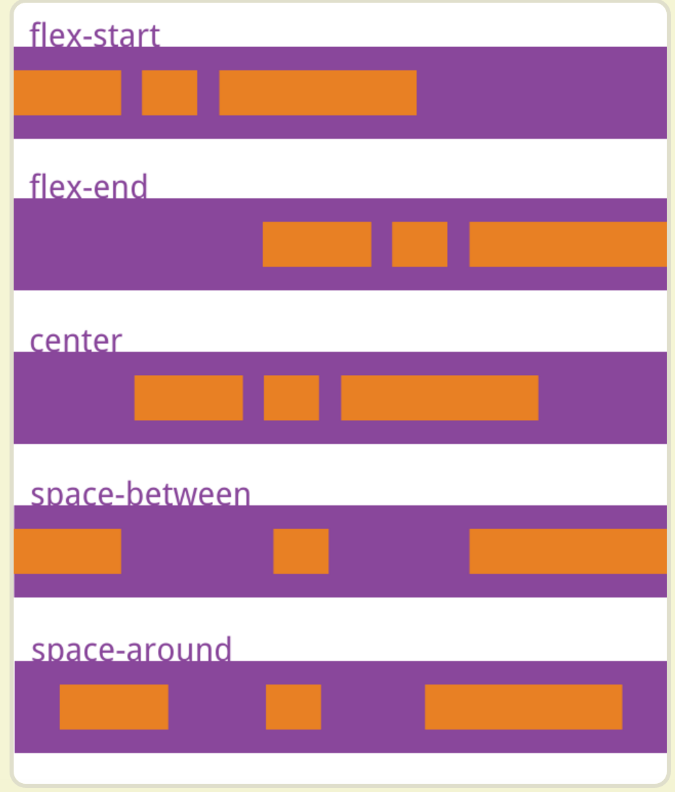

#### 5.align-items

定义了一行的项目在竖直方向上的对齐方式

- `flex-start`：交叉轴的起点对齐。
- `flex-end`：交叉轴的终点对齐。
- `center`：交叉轴的中点对齐。
- `baseline`: 项目的第一行文字的基线对齐。
- `stretch`（默认值）：如果项目未设置高度或设为auto，将占满整个容器的高度。

 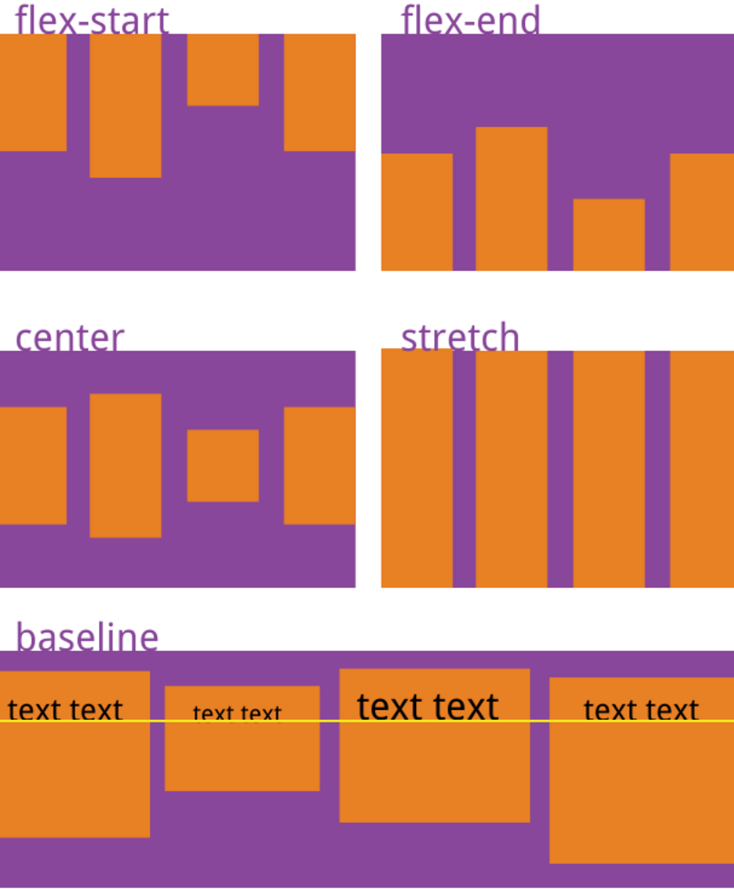

#### 6.align-content

定义了多行元素中美一行在竖直方向上的分布方式

- `flex-start`：与交叉轴的起点对齐。
- `flex-end`：与交叉轴的终点对齐。
- `center`：与交叉轴的中点对齐。
- `space-between`：与交叉轴两端对齐，轴线之间的间隔平均分布。
- `space-around`：每根轴线两侧的间隔都相等。所以，轴线之间的间隔比轴线与边框的间隔大一倍。
- `stretch`（默认值）：轴线占满整个交叉轴。

 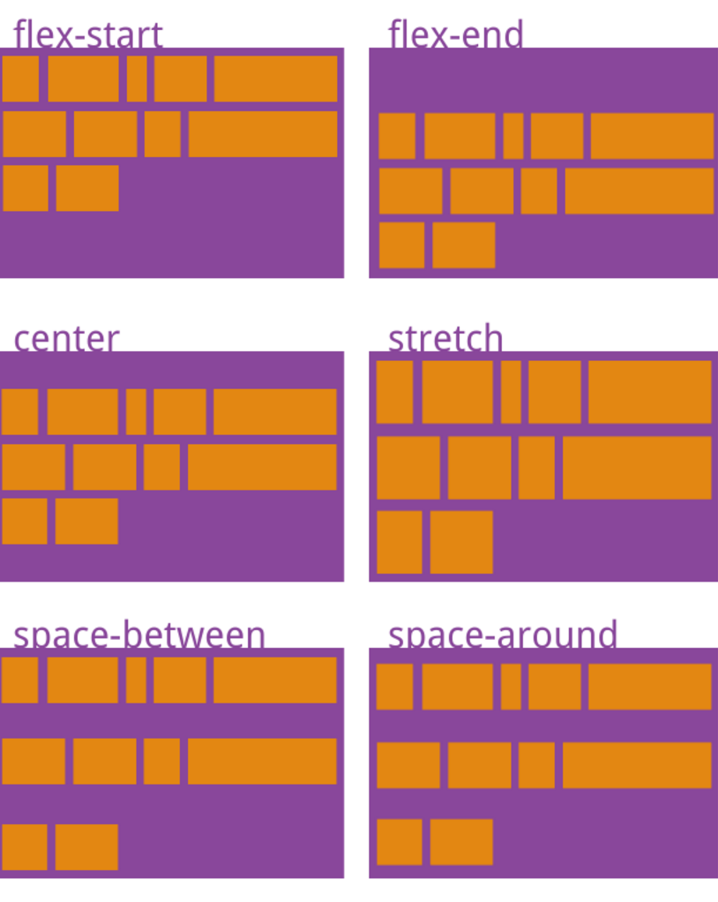


### 三、容器中项目的属性

- `order`
- `flex-grow`
- `flex-shrink`
- `flex-basis`
- `flex`
- `align-self`

#### 1. order

为项目设定序号，项目会按照序号大小在容器中排布

```html
.item {
  order: <integer>;
}
```

#### 2.lex-grow

为项目设置占满空间的放大比例。项目的数值的比例为他们占据整个空间的各自的比例。 默认为0，即有空间也不放大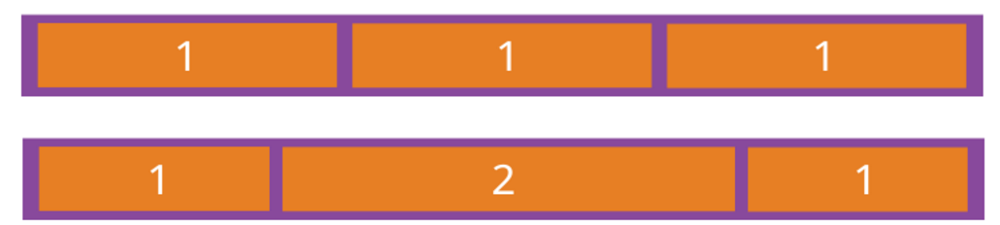

#### 3.flex-shrink

为项目设置占满空间的缩小比例。项目的数值的比例为他们占据整个空间的各自的比例。 默认为1，为使用空间而按比例缩小。负数无效。值为0是不缩小。

#### 4.flex-basis

定义了在分配多余空间之前，项目占据的主轴空间（main size）。浏览器根据这个属性，计算主轴是否有多余空间。它的默认值为`auto`，即项目的本来大小。

> ```html
> .item {
>   flex-basis: <length> | auto; /* default auto */
> }
> ```

它可以设为跟`width`或`height`属性一样的值（比如350px），则项目将占据固定空间。

#### 5.flex

`flex`属性是`flex-grow`, `flex-shrink` 和 `flex-basis`的简写，默认值为`0 1 auto`。后两个属性可选。

> ```
> .item {
>   flex: none | [ <'flex-grow'> <'flex-shrink'>? || <'flex-basis'> ]
> }
>
> ```

该属性有两个快捷值：`auto` (`1 1 auto`) 和 none (`0 0 auto`)。

建议优先使用这个属性，而不是单独写三个分离的属性，因为浏览器会推算相关值。

#### 6.align-self

`align-self`属性允许单个项目有与其他项目不一样的对齐方式，可覆盖`align-items`属性。默认值为`auto`，表示继承父元素的`align-items`属性，如果没有父元素，则等同于`stretch`。

> ```html
> .item {
>   align-self: auto | flex-start | flex-end | center | baseline | stretch;
> }
> ```

该属性可能取6个值，除了auto，其他都与align-items属性完全一致。 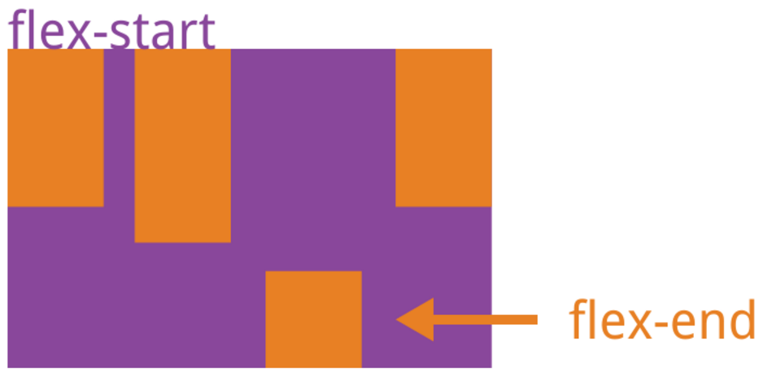

